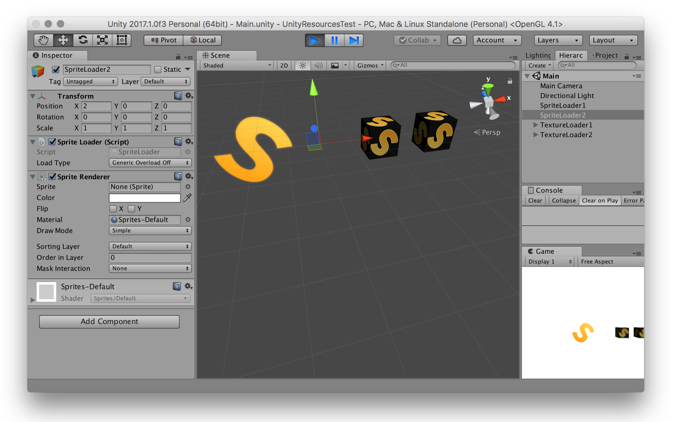

# UnityResourcesTest

Test project to demonstrate different behaviour of [**Resources.Load ()**](https://docs.unity3d.com/ScriptReference/Resources.Load.html) when loading Textures or Sprites.

**Tested with:**

- Unity stable: 2017.1.0f3 

## Loading Sprites 

Assume a simple [MonoBehaviour](https://docs.unity3d.com/ScriptReference/MonoBehaviour.html)-derived class to render a Sprite:

```C#
public class SpriteLoader : MonoBehaviour {

	void Start () {
		var spriteRenderer = gameObject.AddComponent <SpriteRenderer> ();
        spriteRenderer.sprite = /*some sprite resource*/;
	}
}
```

Assigning to `spriteRenderer.sprite` via [Resources.Load ()](https://docs.unity3d.com/ScriptReference/Resources.Load.html) behaves differently, depending on whether or not the generic overload of [Resources.Load ()](https://docs.unity3d.com/ScriptReference/Resources.Load.html) is used:

- The **generic** overload returns a valid Sprite:

	```C#
	// returns a valid sprite
	spriteRenderer.sprite = Resources.Load <Sprite> ("Sprites/S") as Sprite;
	```

- The **non-generic** overload always returns null:

	```C#
	// always returns null
	spriteRenderer.sprite = Resources.Load ("Sprites/S") as Sprite;
	```

## Loading Textures

A similar setup as above for Textures:

```C#
public class TextureLoader : MonoBehaviour {

	void Start () {
		var cube = GameObject.CreatePrimitive (PrimitiveType.Cube);
		var meshRenderer = cube.GetComponent <MeshRenderer> ();

		meshRenderer.material.mainTexture = /*some texture resource*/;
			
		cube.transform.parent = this.transform;
		cube.transform.localPosition = Vector3.zero;
	}
}
```
where both overloads always return valid Texture objects:

- The **generic** overload returns a Texture:

	```C#
		meshRenderer.material.mainTexture = Resources.Load <Texture> ("Textures/S") as Texture;
	```

- As well as the **non-generic** overload:

	```C#
		meshRenderer.material.mainTexture = Resources.Load ("Textures/S") as Texture;
	```
	
## Unity Project

To reproduce this issue, open the Unity project, load the scene located in `Assets/Resources/Scenes` and hit Play.

There are four GameObjects in the scene to demonstrate the above mentioned scenarios:

- **SpriteLoader1**: Load a Sprite via `Resources.Load <Sprite> ()`
- **SpriteLoader2**: Load a Sprite via `Resources.Load ()`
- **TextureLoader1**: Load a Texture via `Resources.Load <Texture> ()`
- **TextureLoader2**: Load a Texture via `Resources.Load ()`

Where SpriteLoader2 fails to load the sprite:



